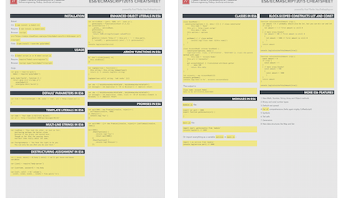

# ES6/ECMAScript2015 Cheatsheet

> ES6 is the new JavaScript.

[Beautifully-designed print-ready PDF](https://node.university/p/library).

This is a brief cheatsheet to look up the syntax of some of the ES6 features. It assumes you know how they work. If not, check [Top 10 ES6 Features Every Busy JavaScript Developer Must Know](http://webapplog.com/es6/) for the detailed explanation.

[](https://node.university/p/library)

## Installation

Babel:

* CLI: `$ npm install -g babel-cli`
* Require: `$ npm install -g babel-core`
* Browser: `<script src="https://cdnjs.cloudflare.com/ajax/libs/babel-core/5.8.34/browser.js"></script>`
* Gulp: `$ npm install --save-dev gulp-babel`


## Usage

* CLI: `$ babel script.js` or `$ babel script.js`
* Require: `require("babel-core/register");`
* Browser: `<script type="text/babel"></script>`

Gulp:

```js
var gulp = require('gulp'),
  babel = require('gulp-babel')

gulp.task('build', function () {
  return gulp.src('src/app.js')
    .pipe(babel())
    .pipe(gulp.dest('build'))
})
```

## Default Parameters in ES6

```js
var link = function(height = 50, color = 'red', url = 'http://azat.co') {
  ...
}
```

## Template Literals in ES6

```js
var name = `Your name is ${first} ${last}.`
var url = `http://localhost:3000/api/messages/${id}`
```

## Multi-line Strings in ES6

```js
var roadPoem = `Then took the other, as just as fair,
	And having perhaps the better claim
	Because it was grassy and wanted wear,
	Though as for that the passing there
	Had worn them really about the same,`

var fourAgreements = `You have the right to be you.
	You can only be you when you do your best.`
```

## Destructuring Assignment in ES6

```js
var { house, mouse} = $('body').data() // we'll get house and mouse variables

var {json} = require('body-parser')

var {username, password} = req.body

var [col1, col2]  = $('.column'),
  [line1, line2, line3, , line5] = file.split('\n')
```


## Enhanced Object Literals in ES6


```js
var serviceBase = {port: 3000, url: 'azat.co'},
    getAccounts = function(){return [1,2,3]}
var accountService = {
    __proto__: serviceBase,
    getAccounts,
    toString() {
     return JSON.stringify((super.valueOf()))
    },
	getUrl() {return "http://" + this.url + ':' + this.port},
    [ 'valueOf_' + getAccounts().join('_') ]: getAccounts()
};
console.log(accountService)    
```


## Arrow Functions in ES6

```js
$('.btn').click((event) =>{
  this.sendData()
})
```

```js
var logUpperCase = function() {
  this.string = this.string.toUpperCase()
  return () => console.log(this.string)
}

logUpperCase.call({ string: 'es6 rocks' })()
```


```js
var ids = ['5632953c4e345e145fdf2df8','563295464e345e145fdf2df9']
var messages = ids.map(value => `ID is ${value}`) // implicit return
```

```js
var ids = ['5632953c4e345e145fdf2df8','563295464e345e145fdf2df9']
var messages = ids.map((value, index, list) => `ID of ${index} element is ${value} `) // implicit return
```

## Promises in ES6


```js
var wait1000 = new Promise((resolve, reject)=> {
  setTimeout(resolve, 1000)
}).then(()=> {
  console.log('Yay!')
})
```

```js
var wait1000 = ()=> new Promise((resolve, reject)=> {setTimeout(resolve, 1000)})

wait1000()
    .then(function() {
        console.log('Yay!')
        return wait1000()
    })
    .then(function() {
        console.log('Wheeyee!')
    });
```

## Block-Scoped Constructs Let and Const


```js
function calculateTotalAmount (vip) {
  var amount = 0 // probably should also be let, but you can mix var and let
  if (vip) {
    let amount = 1 // first amount is still 0
  }
  { // more crazy blocks!
    let amount = 100 // first amount is still 0
    {
      let amount = 1000 // first amount is still 0
      }
  }  
  return amount
}

console.log(calculateTotalAmount(true))
```


```js
function calculateTotalAmount (vip) {
  const amount = 0  
  if (vip) {
    const amount = 1
  }
  { // more crazy blocks!
    const amount = 100
    {
      const amount = 1000
      }
  }  
  return amount
}

console.log(calculateTotalAmount(true))
```


## Classes in ES6

```js
class baseModel {
  constructor(options = {}, data = []) { // class constructor
		this.name = 'Base'
    this.url = 'http://azat.co/api'
		this.data = data
    this.options = options
	}

	getName() { // class method
		console.log(`Class name: ${this.name}`)
	}
}

class AccountModel extends baseModel {
	constructor(options, data) {
    super({private: true}, ['32113123123', '524214691']) //call the parent method with super
		this.name = 'Account Model'
    this.url +='/accounts/'
	}
	get accountsData() { //calculated attribute getter
    // ... make XHR
		return this.data
	}
}

let accounts = new AccountModel(5)
accounts.getName()
console.log('Data is %s', accounts.accountsData)
```

The output is:

```
Class name: Account Model
Data is %s 32113123123,524214691
```

## Modules  in ES6

`module.js` file:

```js
export var port = 3000
export function getAccounts(url) {
 ...
}
```

`main.js` file:

```js
import {port, getAccounts} from 'module'
console.log(port) // 3000
```

Or import everything as a variable `service` in `main.js`:

```js
import * as service from 'module'
console.log(service.port) // 3000
```

---


## More ES6 Features

1. New Math, Number, String, Array and Object methods
2. Binary and octal number types
3. Default rest spread
4. `For of` comprehensions (hello again mighty CoffeeScript!)
5. Symbols
6. Tail calls
7. Generators
8. New data structures like Map and Set

---

## Resources

1. [Learn ES2015](https://babeljs.io/docs/learn-es2015)
1. [ES6 REPL](https://babeljs.io/repl)
1. [ES6 Fiddle](http://www.es6fiddle.net)
2. [*Understanding ECMAScript 6* by Nicolas Zakas book](https://leanpub.com/understandinges6)
3. [*Exploring ES6* by Dr. Axel Rauschmayer](https://leanpub.com/exploring-es6)
1. [*You Don't Know JS: ES6 & Beyond*](https://github.com/getify/You-Dont-Know-JS/blob/master/es6%20&%20beyond/README.md#you-dont-know-js-es6--beyond) by By Kyle Simpson
