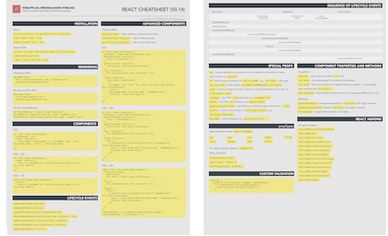

# React Cheatsheet (v0.14)

> Either with your shield, or on it.

[FREE beautifully-designed print-ready PDF.](https://gum.co/IJRtw/git-FB2C5E22)

[](https://gum.co/IJRtw/git-FB2C5E22)

## Installation

React:

* `<script src="https://fb.me/react-0.14.0.js"></script>`
* `$ npm install react --save`
* `$ bower install react --save`

React DOM:

* `<script src="https://fb.me/react-dom-0.14.0.js"></script>`
* `$ npm install react-dom`
* `$ bower install react-dom --save`

## Rendering

### Rendering (ES5)

```js
ReactDOM.render(
  React.createElement(Link, {name: 'HackHall.com'}),
  document.getElementById('menu')
)
```

### Rendering (ES5+JSX)

```js
ReactDOM.render(
  <Link name='HackHall.com'/>,
  document.getElementById('menu')
)
```

## Server-side Rendering

```js
var ReactDOMServer = require('react-dom/server')
ReactDOMServer.renderToString(Link, {name: 'HackHall.com'})
ReactDOMServer.renderToStaticMarkup(Link, {name: 'HackHall.com'})
```


## Components

### ES5

```js
var Link = React.createClass({
  displayName: 'Link',
  render: function() {
    return React.createElement('a', {className: 'btn', title: this.props.name}, 'Click ->', this.props.name);
  }
});
```

### ES5 + JSX

```js
var Link = React.createClass({
  render: function() {
    return <a className='btn' title={this.props.name}>Click -> this.props.name</a>
  }
});
```

### ES6 + JSX

```js
class Link extends React.Component {
  render() {
    return <a className='btn' title={this.props.name}>Click -> this.props.name</a>
  }
}
```

## Advanced Components

### Options (ES5)

* `propTypes object`: Type validation in development mode
* `getDefaultProps function()`: object of default props
* `getInitialState function()`: object of the initial state

ES5:

```js
var Link = React.createClass ({
  propTypes: { name: React.PropTypes.string },
  getDefaultProps: function() {
    return { initialCount: 0 }
  },
  getInitialState: function() {
    return {count: this.props.initialCount};
  },
  tick: function() {
    this.setState({count: this.state.count + 1});
  },
  render: function() {
    return React.createElement(
      'a',
      {className: 'btn', href: '#', title: this.props.name, onClick: this.tick.bind(this)},
      'Click ->',
      (this.props.name? this.props.name : 'webapplog.com'),
      ' (Clicked: '+this.state.count+')'
    );
  }
})
```

ES5 + JSX:

```js
var Link = React.createClass ({
  propTypes: { name: React.PropTypes.string },
  getDefaultProps: function() {
    return { initialCount: 0 }
  },
  getInitialState: function() {
    return {count: this.props.initialCount};
  },
  tick: function() {
    this.setState({count: this.state.count + 1});
  },
  render: function() {
    return (
      <a onClick={this.tick.bind(this)} href="#" className="btn" title={this.props.name}>
        Click -> {(this.props.name? this.props.name : 'webapplog.com')}
        (Clicked: {this.state.count})
      </a>
    );
  }
})
```

ES6 + JSX:

```js
export class Link extends React.Component {
  constructor(props) {
    super(props);
    this.state = {count: props.initialCount};
  }
  tick() {
    this.setState({count: this.state.count + 1});
  }
  render() {
    return (
      <a onClick={this.tick.bind(this)} href="#" className="btn" title={this.props.name}>
        Click -> {(this.props.name? this.props.name : 'webapplog.com')}
        (Clicked: {this.state.count})
      </a>
    );
  }
}
Link.propTypes = { initialCount: React.PropTypes.number };
Link.defaultProps = { initialCount: 0 };
```

## Lifecycle Events


Lifecycle Events:

* `componentWillMount function()`
* `componentDidMount function()`
* `componentWillReceiveProps function(nextProps)`
* `shouldComponentUpdate function(nextProps, nextState)-> bool`
* `componentWillUpdate function(nextProps, nextState)`
* `componentDidUpdate function(prevProps, prevState)`
* `componentWillUnmount function()`

Sequence of lifecycle events:

<table>
  <thead>
    <tr>
      <th>Mounting</th>
      <th colspan="3">Updating</th>
      <th>Unmounting</th>
    </tr>

    <tr>
      <th></th>
      <th>Component Properties</th>
      <th>Component State</th>
      <th>Using forceUpdate()</th>
      <th></th>
    </tr>

  </thead>


  <tbody>

    <tr>
      <td align="center">
        <a href="https://facebook.github.io/react/docs/component-specs.html#getdefaultprops" target="_blank">getDefaultProps()</a>
      </td>
      <td>
      </td>
      <td>
      </td>
      <td>
      </td>
      <td>
      </td>
    </tr>

    <tr>
      <td align="center">
        <a href="https://facebook.github.io/react/docs/component-specs.html#getinitialstate" target="_blank">getInitialState()</a>
      </td>
      <td>
      </td>
      <td>
      </td>
      <td>
      </td>
      <td>
      </td>
    </tr>

    <tr>
      <td align="center">
        <a href="https://facebook.github.io/react/docs/component-specs.html#mounting-componentwillmount" target="_blank">componentWillMount()</a>
      </td>
      <td>
      </td>
      <td>
      </td>
      <td>
      </td>
      <td>
      </td>
    </tr>

    <tr>
      <td>
      </td>
      <td align="center">
        <a href="https://facebook.github.io/react/docs/component-specs.html#updating-componentwillreceiveprops" target="_blank">componentWillReceiveProps()</a>
      </td>
      <td>
      </td>
      <td>
      </td>
      <td>
      </td>
    </tr>

    <tr>
      <td>
      </td>
      <td align="center" colspan="2">
        <a href="https://facebook.github.io/react/docs/component-specs.html#updating-shouldcomponentupdate" target="_blank">shouldComponentUpdate()</a>
      </td>
      <td>
      </td>
      <td>
      </td>
    </tr>

    <tr>
      <td>
      </td>
      <td align="center" colspan="3">
        <a href="https://facebook.github.io/react/docs/component-specs.html#updating-componentwillupdate" target="_blank">componentWillUpdate()</a>
      </td>
      <td>
      </td>
    </tr>

    <tr>
      <td align="center" colspan="4">
        <a href="https://facebook.github.io/react/docs/component-specs.html#render" target="_blank">render()</a>
      </td>

      <td>
      </td>
    </tr>

    <tr>
      <td>
      </td>
      <td align="center" colspan="3">
        <a href="https://facebook.github.io/react/docs/component-specs.html#updating-componentdidupdate" target="_blank">componentDidUpdate()</a>
      </td>
      <td>
      </td>
    </tr>

    <tr>
      <td align="center">
        <a href="https://facebook.github.io/react/docs/component-specs.html#mounting-componentdidmount" target="_blank">componentDidMount()</a>
      </td>
      <td>
      </td>
      <td>
      </td>
      <td>
      </td>
      <td>
      </td>
    </tr>

    <tr>
      <td>
      </td>
      <td>
      </td>
      <td>
      </td>
      <td>
      </td>
      <td align="center">
        <a href="https://facebook.github.io/react/docs/component-specs.html#unmounting-componentwillunmount" target="_blank">componentWillUnmount()</a>
      </td>
    </tr>
  </tbody>
</table>

Inspired by <http://react.tips>

## Special Props

* `key`: Unique identifier for an element to turn arrays/lists into hashes for better performance, e.g., `key={id}`
* `ref`: Reference to an element via `this.refs.NAME`, e.g., `ref="email"` will create `this.refs.email` DOM node or `ReactDOM.findDOMNode(this.refs.email)`
* `style`: Accept an object of styles, instead of a string (immutable since v0.14), e.g., `style={{color: red}}`
* `className`: the HTML `class` attribute, e.g., `className="btn"`
* `htmlFor`: the HTML `for` attribute, e.g., `htmlFor="email"`
* `dangerouslySetInnerHTML`: raw HTML by providing an object with the key `__html`
* `children`: content of the element via `this.props.children`, e.g., `this.props.children[0]`
* `data-NAME`: custom attribute, e.g., `data-tooltip-text="..."`

## propTypes

Types available under `React.PropTypes`:

* `any`
* `array`
* `bool`
* `element`
* `func`
* `node`
* `number`
* `object`
* `string`

To make required, append `.isRequired`.

More methods:

* `instanceOf(constructor)`
* `oneOf(['News', 'Photos'])`
* `oneOfType([propType, propType])`

### Custom Validation

```js
propTypes: {
  customProp: function(props, propName, componentName) {
    if (!/regExPattern/.test(props[propName])) {
      return new Error('Validation failed!');
    }
  }
}
```

## Component Properties and Methods

Properties:

* `this.refs`: Lists components with a `ref` prop
* `this.props`: Any props passed to an element (immutable)
* `this.state`: State set by setState and getInitialState (muttable) — avoid setting state manually with `this.state=...`
* `this.isMounted`: Flag whether the element has a corresponding DOM node or not

Methods:

* `setState(changes)`: Change state (partially) to `this.state` and trigger re-render
* `replaceState(newState)`: Replace `this.state` and trigger re-render
* `forceUpdate()`: Trigger DOM re-render immediately

## React Addons

As npm modules:

* [`react-addons-css-transition-group`](http://facebook.github.io/react/docs/animation.html)
* [`react-addons-perf`](http://facebook.github.io/react/docs/perf.html)
* [`react-addons-test-utils`](http://facebook.github.io/react/docs/test-utils.html)
* [`react-addons-pure-render-mixin`](http://facebook.github.io/react/docs/pure-render-mixin.html)
* [`react-addons-linked-state-mixin`](http://facebook.github.io/react/docs/two-way-binding-helpers.html)
* `react-addons-clone-with-props`
* `react-addons-create-fragment`
* `react-addons-css-transition-group`
* `react-addons-linked-state-mixin`
* `react-addons-pure-render-mixin`
* `react-addons-shallow-compare`
* `react-addons-transition-group`
* [`react-addons-update`](http://facebook.github.io/react/docs/update.html)
